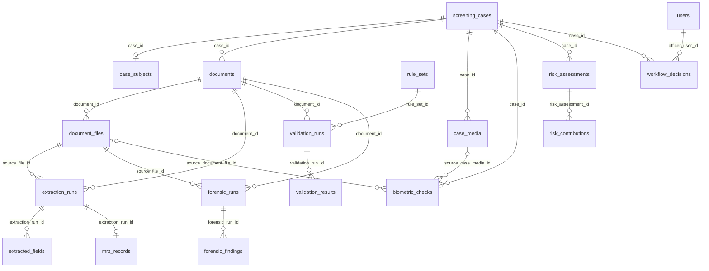

# SentinelTrail — MySQL V1 database

SentinelTrail is an officer-assist identity and travel-document screening project for Smart India Hackathon problem **SIH26188**. This directory contains the validated V1 baseline plus a subsequent user-authentication migration: six ordered MySQL 8.0 migration files, a synthetic demonstration seed, and design, validation, and ERD documentation. The database organizes cases, document and live-capture evidence, versioned analysis results, explainable risk assessments, officer decisions, and retention/audit records. It does not itself run OCR, detect forgeries, match faces, authorize access, or make border decisions.

## Architecture and boundaries

MySQL 8.0/InnoDB is the structured system of record. The intended independent deployment uses self-hosted MinIO for encrypted originals, PDFs, crops, live captures, previews, and model artifacts. MySQL stores generated object IDs, SHA-256 content hashes, lifecycle metadata, and relational links—not image/PDF blobs or direct object-store URLs. **MinIO and the application integrations are architecture requirements, not components delivered by these migrations.**

```text
Checkpoint UI / device
       │ authenticated requests and uploads
       ▼
Backend ──────────────► MySQL 8.0: cases, metadata, results, decisions, audit
   │                         ▲
   ├──────────────────► MinIO: encrypted binary evidence
   │                         │ controlled object references
   └──────────────────► AI / rules workers ──► versioned findings and risk inputs
                               │
                         officer review ──► backend-recorded workflow decision
```

The backend must enforce authentication and authorization, media admission, token use, encryption, audit writes, retention, and object access. Migration 006 adds optional email and password-hash fields and account-policy metadata to `users`; the backend must provision accounts, generate password hashes, and enforce password-change, MFA, and session policies. Workers provide advisory output; an authenticated officer makes the final workflow decision. No external database-as-a-service, vector database, or blockchain is required by V1. See [implementation guardrails](docs/implementation-guardrails.md).

## V1 schema and case workflow

The final schema has **30 tables**. `screening_cases` is the hub: a case belongs to an organization and checkpoint, can identify one `case_subjects` record, and can contain multiple `documents` and independent `case_media` captures. Each document can have multiple `document_files`; OCR, validation, and forensic runs link back to documents and, where relevant, source files. Findings and checks feed advisory case-level risk assessments; `workflow_decisions` records officer action separately.

| Domain | Tables | Role in V1 |
| --- | --- | --- |
| Organization and access | `organizations`, `checkpoints`, `users`, `roles`, `user_roles`, `registered_devices` | Organizational context, personnel, authentication metadata, roles, and registered intake devices. |
| Case and evidence | `screening_cases`, `case_subjects`, `documents`, `document_files`, `case_media`, `case_access_tokens` | Case intake, protected identity values, document/live-media metadata, and short-lived access-token records. |
| OCR and MRZ | `extraction_runs`, `extracted_fields`, `mrz_records` | Versioned extraction, masked field displays, MRZ checksums, and visual/MRZ contradictions. |
| Rules and validation | `rule_sets`, `validation_runs`, `validation_results` | Versioned document rules and explained validation outcomes. |
| Forensics and biometrics | `forensic_runs`, `forensic_findings`, `biometric_checks` | Tamper signals and advisory face-match/liveness checks linked to evidence. |
| Risk and human action | `risk_assessments`, `risk_contributions`, `workflow_decisions` | Advisory score and reasons, followed by a separate officer decision. |
| Accountability and lifecycle | `audit_events`, `retention_policies`, `legal_holds`, `purge_jobs`, `purge_job_items`, `schema_migration_history` | Audit-chain fields, retention policy, hold-aware verified purge records, and migration provenance. |

## Schema overview and ER diagram

The domain table above lists every V1 table. This diagram shows the central case and evidence path using actual V1 table names and foreign-key relationships. The surrounding access, audit, retention, legal-hold, purge, and migration-ledger tables are described elsewhere in this README.



`risk_contributions.source_id` and `audit_events.entity_id` are polymorphic references, not foreign keys, so the diagram does not draw invented links from analysis results to risk contributions. The backend also confirms that separately referenced evidence belongs to the same case before workers or officers use it. AI and rule results are advisory; `workflow_decisions` records the final officer action.

## Evidence, privacy, and security model

- Most entity identifiers are `BINARY(16)` UUIDs. Application-generated UUIDs are preferred; administrative SQL can use `UUID_TO_BIN(..., 1)` / `BIN_TO_UUID(..., 1)`. `schema_migration_history` instead uses a version string as its primary key.
- Timestamps use UTC `DATETIME(6)`; migration sessions set `time_zone = '+00:00'`. Every application connection and migration-ledger writer must also use UTC.
- Sensitive identity and MRZ values have ciphertext columns. The backend must perform authenticated, application-level encryption before insertion and manage keys outside the database. `encryption_key_id` identifies a key; it is not the key itself. OCR `redacted_display_value` is for masks only. JSON metadata and explanations must not become plaintext PII or biometric storage.
- Searchable identity tokens are `BINARY(32)` fields. Production writers must derive them from normalized values using keyed, domain-separated HMAC—not unsalted SHA-256. The seed's placeholder bytes and hashes are **not** production cryptography.
- `document_files` and `case_media` store generated `storage_object_id` references, optional object versions, and `content_sha256` (`BINARY(32)`). The backend must verify file bytes against the recorded hash and authorize every MinIO resolution. The SQL package contains metadata and synthetic references, not actual demo images or MinIO objects.
- New media starts quarantined. Approval requires a `retention_until` and a malware status of `clean` or `not_applicable`; the backend must also check file signature, size, dimensions, and malware results before allowing OCR or AI processing. Preserve originals and write derived evidence as separate immutable objects.
- `case_access_tokens` stores only a token hash with purpose, issuer, optional device, expiry, consumption, and revocation. A QR code should contain only a short-lived opaque token. The backend must atomically validate role/device/purpose/expiry/revocation and consume it once. `screening_cases.case_token_hash` is a legacy correlation field, not the new QR/view-token mechanism.
- Biometric references belong only in encrypted fields; no raw embeddings, templates, or liveness vectors belong in plaintext or JSON. Face matching requires both live case media and document-file evidence; liveness requires live case media. The schema constrains these evidence shapes, while the backend must also verify that referenced evidence belongs to the appropriate case/document.

## Analysis and officer decisions

`extraction_runs`/`extracted_fields` support OCR; `mrz_records` stores encrypted MRZ material, checksum outcomes, and a visual-versus-MRZ contradiction flag. `rule_sets` and `validation_results` provide issuer/template/rule-version context and explained checks. `forensic_findings` records typed tamper signals, severity, confidence, and optionally a foreign-keyed evidence document file. `biometric_checks` records advisory face or liveness outcomes with controlled evidence references.

Runs record engine and version information; applicable extraction, forensic, biometric, and risk records also carry model versions. `risk_assessments` holds a case-level score, band, policy version, and recommendation (`proceed`, `review`, or `escalate`); `risk_contributions` records supporting reasons and evidence. A contradiction or suspicious signal is evidence for review, not proof of fraud. A score is **not** a decision: only an officer-linked `workflow_decisions` row can record `clear`, `refer`, `hold`, or `cancelled`. There is no V1 `deny_entry` workflow outcome.

For issuer-sensitive validation, use the three-character ICAO-compatible `issuing_state_code` on documents, MRZ records, and rule sets. Legacy two-character issuer fields remain for migration context; checkpoint `country_code` is geographic ISO alpha-2. A generated active-rule identity constrains duplicate active document-type/issuer/template/rule versions. The backend must separately reject overlapping effective-date windows because the database has no range-exclusion constraint.

## Audit, retention, and deletion

`audit_events` contains `previous_event_hash` and `event_hash` for a per-organization hash chain. The **application must build and serialize** canonical hash-chain writes, give the runtime audit role append-only access, and periodically anchor the terminal hash outside MySQL. The schema stores chain data but does not independently prove that every event was logged or that hashes were computed correctly.

`retention_policies` records policy inputs. Approved document files and case media receive per-object `retention_until`; the backend must treat that assigned deadline as fixed rather than recomputing it from later policy edits. `legal_holds` must stop automated deletion until authorized release. `purge_jobs` and `purge_job_items` track deletion of **exactly one** document file or case-media object per item. A `deleted` item requires `object_deletion_verified_at`; the worker must actually delete and verify absence in MinIO, record a deletion certificate, and audit the action. These operational steps are not performed by SQL alone.

The [cost and retention policy](docs/cost-and-retention-policy.md) gives **configurable SIH-demo suggestions**, not legal or production retention periods. Its short-lived live-media class, selective forensic artifacts, processing reuse, and bounded workers reduce cost without relaxing evidence controls. Migration 005's 3,650-day retention for four synthetic fixtures is only a demo repair, not a policy default.

`schema_migration_history` (created by migration 005) stores migration version, exact filename, SHA-256 checksum bytes, UTC application time, and operator identity. Deployment tooling must add verified records after successful application and checks; when adopting 005, backfill verified entries for 001–004. The table does not populate itself.

## Migrations and demo data

Apply the SQL files in filename order to an **empty, authorized** MySQL 8.0 database using a UTC session. The scripts do not create or select a database. MySQL 8.0.16+ is required for enforced `CHECK` constraints; the documented execution baseline is MySQL **8.0.45**. DDL can commit implicitly, so stop at an error and verify state before recording ledger entries or retrying. Do not apply the seed to a real-data environment.

```text
001_initial_schema.sql                  Core case, evidence, analysis, decision, audit, and retention tables
002_indexes_and_constraints.sql         Query indexes and additive lifecycle/integrity checks
003_seed_demo_data.sql                  Four synthetic cases and supporting demo rows ONLY
004_security_and_lifecycle_fixes.sql    Masking, access tokens, media lifecycle, ICAO codes, case media, evidence links, workflow corrections
005_operational_integrity_fixes.sql     Demo media repair, approved-media and biometric checks, two-target purge design, active-rule identity, migration ledger
006_user_authentication.sql             User email, password-hash and account-policy fields; organization-scoped email uniqueness
```

Migration 006 alters `users` only; it does not create a default account. The backend must store an Argon2id or bcrypt hash, never a plaintext password.

The seed's four cases are deliberately small fixtures, not genuine documents or outputs from real AI processing:

| Case | Synthetic scenario | Recorded V1 state |
| --- | --- | --- |
| `SYN-CASE-001` | Clear passport: visual and MRZ values agree. | Low advisory risk; officer `clear` decision; case closed with `closed_at`. |
| `SYN-CASE-002` | Passport with conflicting visual and MRZ expiry dates. | Failed validation, high advisory risk; remains `in_review`. |
| `SYN-CASE-003` | Passport with suspected photo replacement. | High-severity forensic finding and advisory risk; remains `in_review`. |
| `SYN-CASE-004` | Visa with suspected fake stamp. | High-severity forensic finding and advisory risk; remains `in_review`. |

The four demo `document_files` rows are marked approved/`not_applicable` by migration 005 so they are compatible with final lifecycle constraints. They use `demo-key-not-production`, placeholder ciphertext/hashes, and object IDs without accompanying image files. Do not infer that a real scanner, MinIO upload, OCR engine, or forensic model was exercised by these fixtures.

## Validation status

The package documentation records successful execution of migrations **001–005 on MySQL Server 8.0.45** and a **30-table V1 baseline**. Migration 006 adds columns and constraints to `users` without adding tables; its execution has not been established by those earlier validation records. The reported read-back checks include the four seeded cases (one closed; three in review), four approved synthetic document files with `not_applicable` malware status, migrated `IND` issuer codes, and an active issuer-aware demo rule. Static reviews also checked migration ordering, references, and seed compatibility. See the [review fixes](docs/review-fixes.md) and [ERD notes](docs/erd.md).

The [disposable-database validation plan](docs/mysql-8-validation-plan.md) is **not a claim that every listed test passed**. It includes negative constraint/FK inserts, token-concurrency and authorization tests, legal-hold and MinIO deletion verification, rule-window publishing tests, and migration-ledger checks. Those require an authorized disposable database plus backend/object-store test harnesses where specified. Do not treat seed rows or schema constraints as proof of end-to-end security or model accuracy.

## Why this design, and what remains

Foreign keys, checks, and indexes give the case workflow a structured relational base. Versioned runs and explicit risk contributions make results inspectable; file hashes, object references, and evidence foreign keys support traceability. Encryption and HMAC boundaries reduce exposure of identity data, while audit, legal-hold, and verified-purge records give the backend a concrete accountability model. Keeping large media in a self-hosted object store makes storage and processing more cost-conscious than putting binaries in MySQL. These are **schema and design advantages**, conditional on correct application and infrastructure implementation.

V1 is a validated **database package**, not a deployed screening platform. The next engineering stage is to integrate the backend with MySQL; provision and secure MinIO; implement encrypted upload, quarantine/scan, object hashing, access tokens, audit chaining, retention/purge workers, and migration-ledger operations; connect OCR/MRZ, rule, forensic, biometric, and risk workers; then add authenticated API/dashboard flows and officer review. Test rule-window overlap rejection, cross-case evidence ownership, concurrent token consumption, and the remaining [validation-plan](docs/mysql-8-validation-plan.md) cases before claiming production readiness. No model accuracy, latency, or field-operational performance is established by V1.
